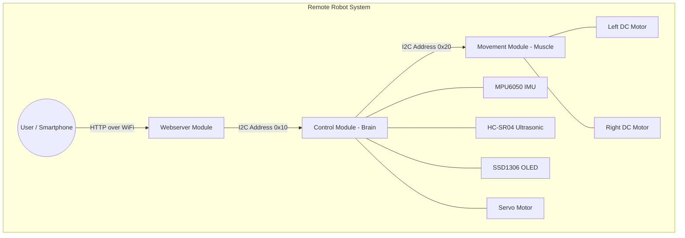

# Remote-Controlled Two-Wheel Robot 🤖

This repository contains the embedded firmware for a distributed, remote-controlled two-wheel robot. The system is architected across multiple microcontroller boards to separate concerns: high-level control/sensor fusion, low-level motor actuation, and wireless user interfacing.

## 📡 System Architecture

The robot operates on a distributed I2C-based network. 
1. **Webserver Module (ESP8266)**: Acts as a WiFi Access Point and hosts a web-based control panel. It translates HTTP requests from a user's device into I2C commands.
2. **Control Module (Arduino)**: The "Brain". It reads sensor data (IMU, Ultrasonic), manages the robot's state, displays telemetry on an OLED screen, and coordinates the other modules.
3. **Movement Module (Arduino)**: The "Muscle". It receives high-level directional commands via I2C and handles the precise PWM control of the DC motors.

### Architecture Diagram



## 📂 Codebase Structure

The repository is divided into three main directories, each representing a separate firmware project intended to be compiled and flashed to its respective microcontroller.

```text
.
├── control_module/       # The "Brain" - Sensor fusion, state machine, I2C master
│   ├── control_module.ino
│   ├── scheduler.cpp/h   # Non-blocking cooperative task scheduler
│   ├── state_machine.cpp/h # Autonomous navigation state machine (WIP)
│   ├── web_comm.cpp/h    # I2C communication with Webserver Module
│   ├── motor_comm.cpp/h  # I2C communication with Movement Module
│   ├── imu.cpp/h         # MPU6050 driver
│   ├── ultrasonic.cpp/h  # HC-SR04 driver
│   ├── servo.cpp/h       # Servo motor control
│   ├── display.cpp/h     # SSD1306 OLED UI
│   ├── debug.cpp/h       # Serial telemetry output
│   └── robot_types.h     # Shared enums for States and Events
│
├── movement_module/      # The "Muscle" - Motor kinematics and PWM control
│   ├── movement_module.ino
│   ├── MovementSystem.h  # Differential drive logic (forward, rotate, brake)
│   └── Motor.h           # Low-level H-Bridge / DC Motor wrapper
│
└── webserver_module/     # The "Interface" - WiFi AP and Web UI
    ├── webserver_module.ino
    └── web_page.h        # Embedded HTML/CSS/JS remote control panel
```

## 🧠 Module Details

### 1. Control Module
The central coordinator. It uses a **custom cooperative scheduler** (`scheduler.cpp`) to run tasks at specific intervals without blocking (e.g., reading IMU every 10ms, updating OLED every 200ms).
* **I2C Master**: Polls the ESP8266 (`0x10`) for user commands and pushes movement instructions to the Motor board (`0x20`).
* **State Machine**: Contains a framework for autonomous behaviors (e.g., `EXPLORE`, `FOLLOW_LEFT_WALL`, `TURN_AROUND`) based on sensor events.
* **Telemetry**: Outputs real-time IMU, Ultrasonic, and Command data to both the Serial Monitor and the onboard OLED display.

### 2. Movement Module
Dedicated purely to actuation. It listens for I2C interrupts and immediately updates motor states.
* **Kinematics**: Handled by `MovementSystem.h`, which abstracts differential drive logic (calculating left/right motor speeds for forward, backward, and rotational movements).
* **Motor Abstraction**: `Motor.h` provides a clean API for direction and PWM speed control, including safety bounds checking.

### 3. Webserver Module
Provides a seamless user experience without requiring a dedicated app.
* **WiFi AP**: Broadcasts an SSID (`ESP8266`) for direct connection.
* **Web UI**: Serves a modern, mobile-responsive HTML5 control panel (stored in `web_page.h`) with touch-friendly D-Pad buttons.
* **I2C Slave**: Listens at address `0x10`. When the Control Module requests data, it sends the latest HTTP command received from the web UI.

## 🔌 Communication Protocol

The modules communicate using a shared 8-bit Command Enum over I2C:

| Hex Value | Command | Description |
| :--- | :--- | :--- |
| `0x00` | `FORWARD` | Drive straight ahead |
| `0x01` | `BACKWARD` | Reverse straight |
| `0x02` | `TURN_RIGHT` | Rotate / Steer Right |
| `0x03` | `TURN_LEFT` | Rotate / Steer Left |
| `0x04` | `BRAKE` | Emergency stop / Hold |
| `0x05` | `NONE` | Idle / No input |

**I2C Addresses:**
* `0x10`: Webserver Module (ESP8266)
* `0x20`: Movement Module (Arduino)
* `0x3C`: SSD1306 OLED Display
* `0x68`: MPU6050 IMU

## 🛠️ Hardware Requirements

Based on the pin configurations and libraries used in the code:
* **Microcontrollers**: 
  * 1x ESP8266 (e.g., NodeMCU / Wemos D1 Mini) for Webserver
  * 2x Arduino (e.g., Nano / Uno) for Control and Movement
* **Sensors & Actuators**:
  * MPU6050 (Accelerometer + Gyro)
  * HC-SR04 (Ultrasonic Distance Sensor)
  * SSD1306 128x64 I2C OLED
  * Standard Servo (e.g., SG90)
  * 2x DC Gearbox Motors
  * Motor Driver (e.g., TB6612FNG or L298N)
* **Libraries Required**:
  * `Wire.h` (Built-in)
  * `Servo.h` (Built-in)
  * `ESP8266WiFi.h` & `ESP8266WebServer.h`
  * `Adafruit_GFX` & `Adafruit_SSD1306`

## 🚀 Getting Started

1. **Wire the I2C Bus**: Ensure all boards share a common Ground (GND) and that the I2C lines (SDA/SCL) are properly connected between the Control Module, Webserver Module, and Movement Module. Pull-up resistors (4.7kΩ) are recommended on SDA/SCL if the boards don't have them built-in.
2. **Flash the Boards**: Open each respective `.ino` file in the Arduino IDE, ensure the correct board and port are selected, and upload.
3. **Connect & Drive**: 
   * Connect your phone/PC to the `ESP8266` WiFi network (Password: `12345678`).
   * Open a browser and navigate to `192.168.1.1`.
   * Use the on-screen D-Pad to control the robot!
